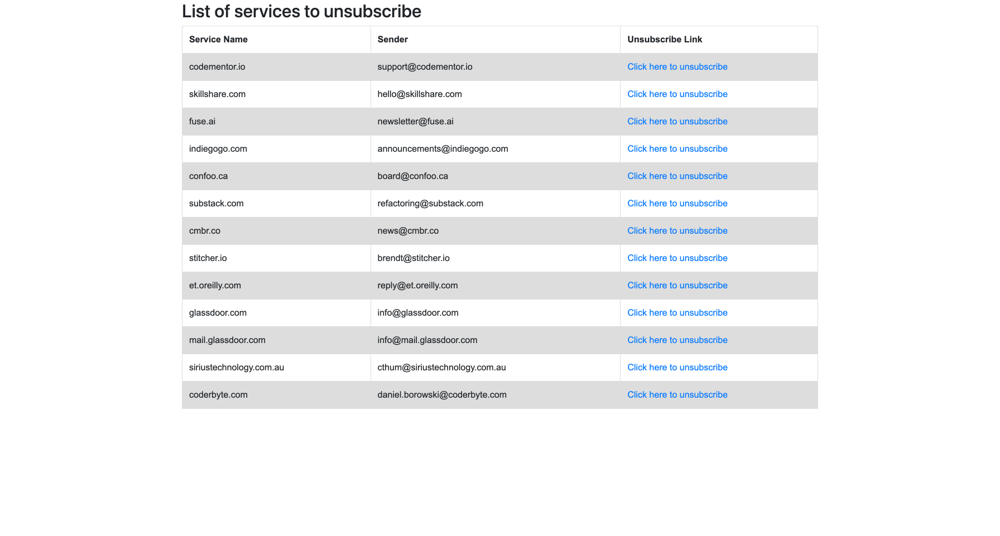

# Email Unsubscriber

This is just a tutorial on learning golang where app is containerized using docker. On server side Golang (echo framework) is used, on database postgres & for message queue Rabbitmq has been used.

It is really hard to unsubscribe from Gmail because we might have many emails. The aim of this project is to easily provide way to unsubscribe email by creating your own app and run the code from opensource.
There are many great tools already built for this. However this has been built just to play around with the Google API and learn Golang

With this project everything is owned by your local machine i.e

* You will use your created google app
* You will use your own email token
* Your data will be saved in local database postgres

## Getting Google Credentials
* Create a Google Cloud Project (https://console.cloud.google.com/home/dashboard)
* Configure Oauth Consent Screen https://nimb.ws/oAdiVm
* Fill out the consent form and give use your email that you want to scan for https://nimb.ws/fJkjSM and click save and add your email as test email in next wizard
* Create Credentials for Oauth Client Id like https://nimb.ws/xwLXv0  use same `localhost`  as authorized & redirect uris
* Download oauth client json file https://nimb.ws/Y2yEaS
* Copy same json file and rename it to `credentials.json` and place it inside the project root which will be used by our application to generate `token.json`
* Enable Gmail Api Access by following this link and then enable it
* Run `make publish` it will print your the link that you can use to generate token. After you see the click kindly click it
* Select your email and allow permission to app if everything went right you will be redirected to something like `https://localhost/callback?state=state-token&code=4/0AX_KGFABMBFMNBXCZXCwbxzbckjasgdiasug&scope=https://www.googleapis.com/auth/gmail.readonly`
*  copy the code `4/0AX_KGFABMBFMNBXCZXCwbxzbckjasgdiasug`  which will look like this and paste in CLI. If everything goes well it will generate a  `token.json` file which will be used on every authentication

## Usage
* You will find `.env` has two vars `SEARCH_DATE_FROM` which accept date format in `2022-01-01` and `INBOX_SEARCH_QUERY` which has initially promotional label `label=promotions`, if you keep it blank it will search all emails. 
* Run `make publish` it will read all the email from your inbox and put those emails on RabbitMq to parse the unsubscribe link 
* Run `make consume` it will consume all the queue published by first command and start parsing the link
* The make commands publish and consume will take a quiet time depending upon the number of emails in your inbox
* Run `make serve-frontend` which will present you the service name, sender email & the unsubscribe link which you can simply click and unsubscribe

If you are able to complete all the process your final UI would look like 

## Things to do

- Write test

